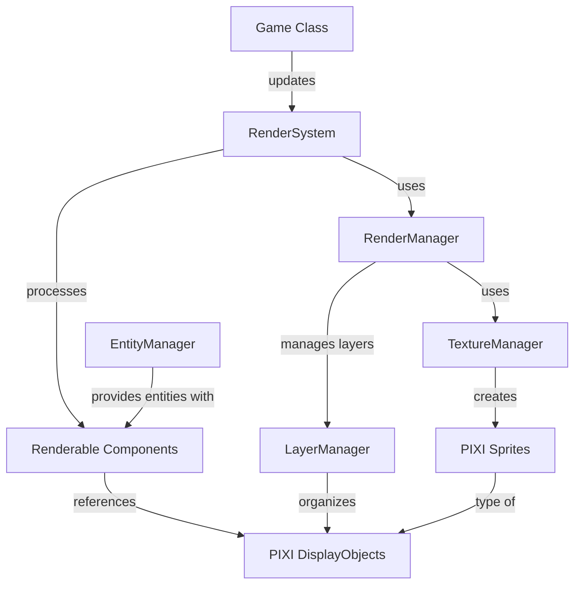

# Rendering System Architecture

This document describes the architecture of the TerraFlux rendering system, which is based on PixiJS.

## System Overview

The rendering system is responsible for visualizing game entities on screen. It connects the Entity-Component-System (ECS) architecture to the PixiJS rendering engine.

## Architecture Diagram

## Core Components

### RenderManager

The `RenderManager` is the central orchestrator of the rendering system. It:

- Initializes the PixiJS application and WebGL context
- Manages the main rendering loop
- Coordinates with the LayerManager to organize visual elements
- Controls the camera and viewport
- Handles resizing and display adjustments
- Tracks performance metrics

**File Location:** `src/game/rendering/RenderManager.ts`

### LayerManager

The `LayerManager` organizes visual elements into logical layers with defined draw order. It:

- Creates and manages PIXI.Container instances for each layer
- Enforces z-ordering between layers
- Enables batch operations on groups of related display objects
- Facilitates effects that apply to entire layers

**File Location:** `src/game/rendering/LayerManager.ts`

### TextureManager

The `TextureManager` handles loading, caching, and optimizing game assets. It:

- Loads sprite textures and texture atlases
- Implements caching to prevent redundant loading
- Manages memory by unloading unused textures
- Handles texture creation and manipulation

**File Location:** `src/game/rendering/TextureManager.ts`

### RenderSystem

The `RenderSystem` connects the ECS architecture to the rendering pipeline. It:

- Processes entities with Renderable components
- Updates visual representations based on game state
- Handles attachment and detachment of display objects
- Manages visual effects and animations

**File Location:** `src/game/rendering/systems/RenderSystem.ts`

### Renderable Component

The `Renderable` component attaches to entities that need visual representation. It:

- Stores references to PIXI display objects
- Defines visual properties (position, scale, rotation, etc.)
- Controls special effects and visual state
- Manages visibility and layer assignment

**File Location:** `src/game/components/Renderable.ts`

## Rendering Pipeline

1. Game loop calls RenderSystem.update()
2. RenderSystem processes entities with Renderable components
3. For new Renderables, display objects are created using TextureManager
4. Display objects are positioned based on entity data
5. LayerManager organizes display objects into appropriate containers
6. RenderManager executes the PixiJS render cycle
7. Performance metrics are captured for monitoring

## Current Implementation Status

- Basic architecture is in place
- Core classes have been implemented
- Next step is finalizing PixiJS integration and testing basic sprite rendering

## Next Steps for Phase 3

1. Complete WebGL context initialization
2. Implement asset loading pipeline with progress tracking
3. Add performance monitoring hooks
4. Test basic sprite rendering
5. Begin camera system implementation
